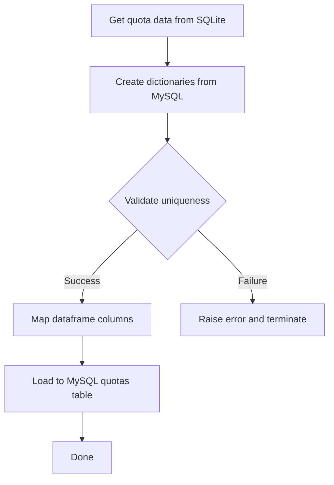

# Plan: Extend load_quota_to_mysql.py for MySQL Loading

## Overview
Extend the existing `load_quota_to_mysql.py` program to load the processed quota data to MySQL database with proper code mapping.

## MySQL Table Schema
**Table:** `quotas`
```sql
CREATE TABLE quotas (
    id INT AUTO_INCREMENT PRIMARY KEY,
    process_code VARCHAR(50),
    cat1_code VARCHAR(50),
    cat2_code VARCHAR(50),
    model_code VARCHAR(50),
    unit_price DECIMAL(10,2),
    effective_date VARCHAR(8),
    obsolete_date VARCHAR(8),
    created_by VARCHAR(50),
    created_at DATETIME
)
```

## Data Mapping

### Source DataFrame Columns
| Source Column | Target Column | Mapping Function |
|--------------|---------------|------------------|
| 类别1 | cat1_code | cat1_dict |
| 类别2 | cat2_code | cat2_dict |
| 型号 | model_code | model_dict |
| 加工工序 | process_code | process_dict |
| 定额 | unit_price | Direct |
| effected_from | effective_date | Direct |
| obsolete_date | obsolete_date | Direct |
| 'root' | created_by | Constant |
| current_timestamp | created_at | Generated |

## Implementation Plan

### 1. Create Dictionary Functions

#### Function: `get_cat1_dict()`
- Query: `SELECT cat1_code, name FROM process_cat1`
- Validate: Check all names are unique
- Return: Dictionary `{name: cat1_code}`
- Error: Raise ValueError if duplicate names found

#### Function: `get_cat2_dict()`
- Query: `SELECT cat2_code, name FROM process_cat2`
- Validate: Check all names are unique
- Return: Dictionary `{name: cat2_code}`
- Error: Raise ValueError if duplicate names found

#### Function: `get_model_dict()`
- Query: `SELECT model_code, name FROM motor_models`
- Validate: Check all names are unique
- Return: Dictionary `{name: model_code}`
- Error: Raise ValueError if duplicate names found

#### Function: `get_process_dict()`
- Query: `SELECT process_code, name FROM processes`
- Validate: Check all names are unique
- Return: Dictionary `{name: process_code}`
- Error: Raise ValueError if duplicate names found

### 2. Create Mapping Function: `map_dataframe_to_quotas(df, cat1_dict, cat2_dict, model_dict, process_dict)`
- Map each column using corresponding dictionary
- Handle missing keys (raise error or use default)
- Create new DataFrame with MySQL column names
- Add created_by and created_at columns

### 3. Create Load Function: `load_to_mysql(quotas_df)`
- Get MySQL connection from environment
- Use pandas `to_sql()` with `if_exists='append'`
- Handle errors and provide feedback

### 4. Update Main Function
- Step 1: Get quota data from SQLite
- Step 2: Create 4 dictionaries from MySQL
- Step 3: Map dataframe to MySQL schema
- Step 4: Load to MySQL
- Step 5: Save to HTML (optional)

## Error Handling
- **Missing dictionary keys**: Raise error with details about which value couldn't be mapped
- **Duplicate names in source tables**: Raise ValueError with table name
- **MySQL connection errors**: Handle with try-except and provide feedback
- **Data type conversion errors**: Validate numeric fields

## Example Usage
```python
# Get dictionaries
cat1_dict = get_cat1_dict()
cat2_dict = get_cat2_dict()
model_dict = get_model_dict()
process_dict = get_process_dict()

# Map dataframe
quotas_df = map_dataframe_to_quotas(df, cat1_dict, cat2_dict, model_dict, process_dict)

# Load to MySQL
load_to_mysql(quotas_df)
```

## Workflow Diagram

