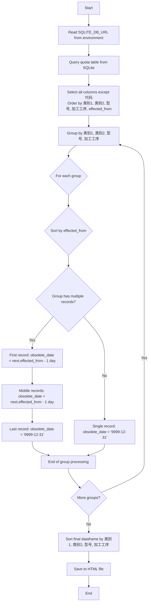

# Plan: load_quota_to_mysql.py

## Overview
Create a new Python program that reads quota data from SQLite, processes it to add `obsolete_date` column for ALL records, and exports to HTML.

## Workflow Diagram



## Step-by-Step Implementation

### 1. Import Required Modules
- `os` - for environment variables
- `pandas` - for data manipulation
- `sql_util` - for database operations (import `sqlite_sql`)
- `datetime` - for date calculations

### 2. Create Main Processing Function `get_quota_with_obsolete_date()`
**Parameters:** None (reads from `SQLITE_DB_URL` environment variable)

**Steps:**
1. Build SQL query to select all columns except `代码` from `quota` table:
   ```sql
   SELECT 类别1, 类别2, 型号, 加工工序, 定额, effected_from 
   FROM quota 
   ORDER BY 类别1, 类别2, 型号, 加工工序, effected_from
   ```
2. Execute query using `sqlite_sql()` from sql_util
3. Add `obsolete_date` column using groupby operation:
   - Sort by `effected_from` within each group (类别1, 类别2, 型号, 加工工序)
   - For first record in group: `obsolete_date = next_record.effected_from - 1 day`
   - For last record in group: `obsolete_date = '9999-12-31'`
   - **If only one record in group:** `obsolete_date = '9999-12-31'`
4. Sort final dataframe by `类别1, 类别2, 型号, 加工工序`
5. Return processed dataframe

### 3. Implement Date Calculation Logic
- Convert `effected_from` to datetime format (format: YYYYMMDD)
- Group by (类别1, 类别2, 型号, 加工工序)
- For each group:
  - Sort by `effected_from`
  - Shift `effected_from` to get next record's date
  - For first record: subtract 1 day from next record's `effected_from`
  - For single-record groups or last record: `'9999-12-31'`

### 4. Create Main Function
- Call `get_quota_with_obsolete_date()`
- Save dataframe to HTML file using `df.to_html()`
- Add print statements for progress tracking

### 5. Add Error Handling
- Try-except blocks for database operations
- Validate environment variables are set
- Handle date parsing errors

## Key Technical Details

### Database Connection Pattern
```python
from sql_util import sqlite_sql
df = sqlite_sql(query)
```

### Obsolete Date Logic Examples

**Example 1: Group with 3+ records**
For effected_from: 20200301, 20201201, 20210101, 20211001, 20211201
- obs_date[0] = 20201130 (20201201 - 1 day)
- obs_date[1] = 20201231 (20210101 - 1 day)
- obs_date[2] = 20210930 (20211001 - 1 day)
- obs_date[3] = 20211130 (20211201 - 1 day)
- obs_date[4] = '9999-12-31' (last record)

**Example 2: Group with single record**
For effected_from: 20200301
- obs_date[0] = '9999-12-31' (only record in group)

## Environment
- Conda environment: `payroll`
- SQLite DB URL: from `SQLITE_DB_URL` environment variable (default: `sqlite:////home/richard/shared/jianglei/payroll/payroll_database.db`)

## Output
- HTML file with all quota data including `obsolete_date` column
- Sorted by `类别1, 类别2, 型号, 加工工序`
